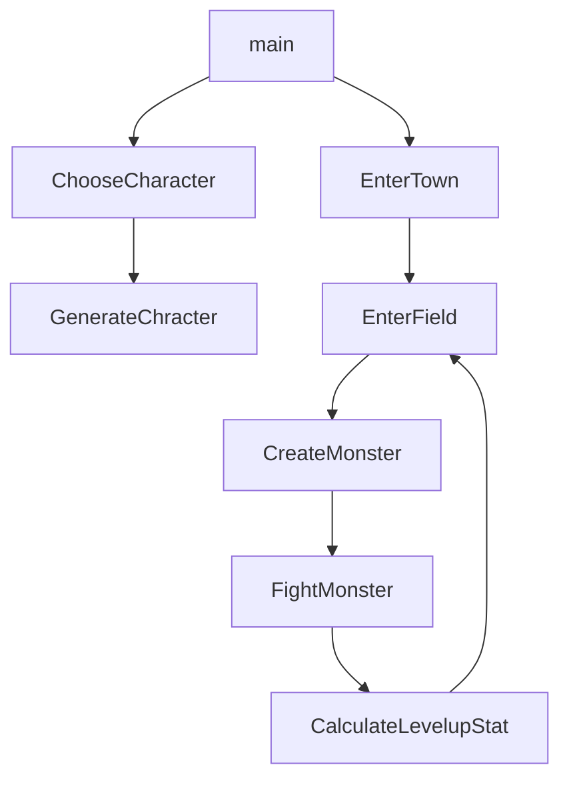

# cpp-TextRPG
- C++에서 공부한 내용을 활용하여 만드는 TextRPG

## 현재 시스템 구조

```mermaid
flowchart TD
	%% 메인 분기점
	main --> EnterTown
    main --> ChooseCharacter
    
    ChooseCharacter --> GenerateChracter
    
    EnterTown --> EnterField
    EnterField --> CreateMonster
    CreateMonster --> FightMonster
    
    %% 분기 없이 핵심 흐름으로 직결
    FightMonster --> CalculateLevelupStat
    CalculateLevelupStat --> EnterField

```
