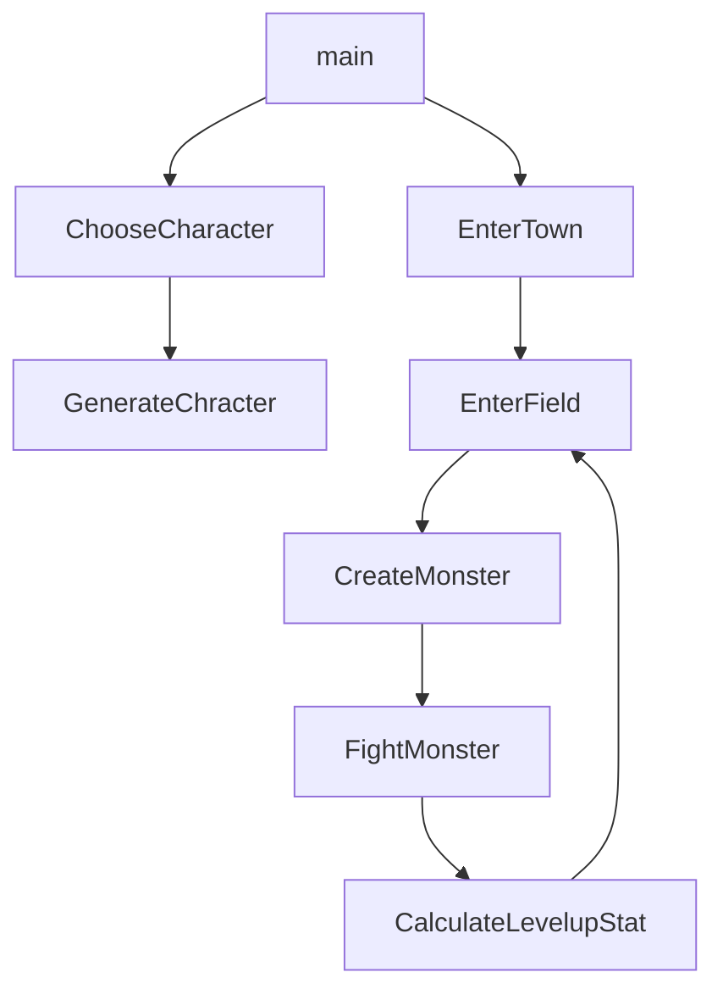

# cpp-TextRPG
- 강의나 책을 따라가면서 배운 내용들을 하나하나씩 TextRPG에 적용시켜보는 프로젝트.
- C++ 기본 문법부터 추후 게임 서버까지 붙이는게 주 목표

## 현재 시스템 구조

```mermaid
flowchart TD
	%% 메인 분기점
	main --> EnterTown
    main --> ChooseCharacter
    
    ChooseCharacter --> GenerateChracter
    
    EnterTown --> EnterField
    EnterField --> CreateMonster
    CreateMonster --> FightMonster
    
    %% 분기 없이 핵심 흐름으로 직결
    FightMonster --> CalculateLevelupStat
    CalculateLevelupStat --> EnterField

```
